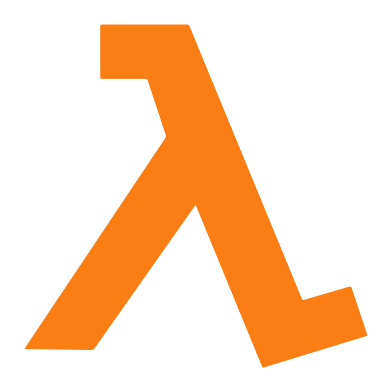

# Assessment 2: Create a cloud function to return the user details

Chosen language: Python

Chosen Cloud Provider: AWS

## How to use
1. Clone the repository
2. Navigate to the `assessment2` directory
3. Configure your aws credentials using `aws configure`
4. Run the following command to deploy the cloud function:
```bash
terraform init
terraform plan
terraform apply
```

<code></code>

## Tech Stack
<code></code>
<code></code>

